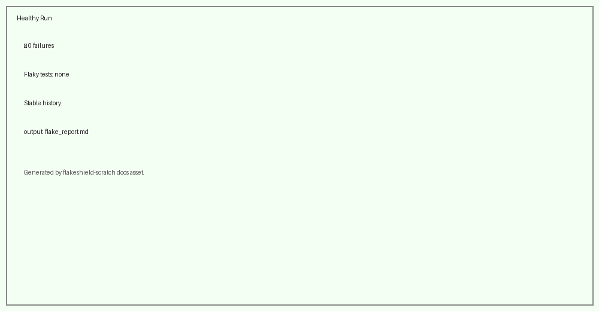
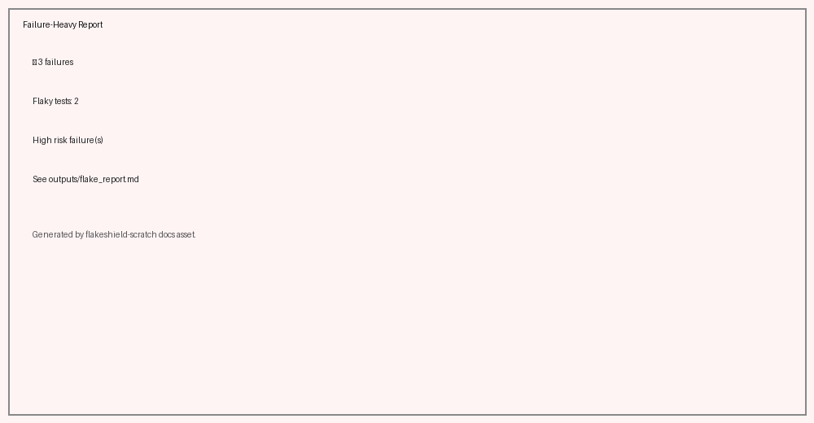

# FlakeShield

FlakeShield reads repeated JUnit XML runs and turns them into a short CI triage report — flaky tests, grouped failures, and what to fix first. One workflow step. No pip install. No secrets.

## Install

```yaml
- name: Run FlakeShield
  uses: deeoli/flakeshield-action@v0.6.0-beta.1
  with:
    reports: "outputs/junit_run*.xml"
    out_prefix: outputs/flake_report
    db_path: outputs/flakeshield.db
```

Run tests first to produce JUnit XML, then point `reports` at those files. Full example: [`examples/canonical-workflow.yml`](examples/canonical-workflow.yml).

## What FlakeShield Does

- Detects flaky tests
- Groups related failures
- Prioritizes risk
- Generates CI summaries

## Example Outputs

**Healthy run**



**Failure report**



**PR comment**


## Example Report Sections

From a real failure-heavy run:

**Fix First**

```markdown
## 🔥 Fix First
1. **Assertion mismatch: assert 1 == 2**

   **Status:** New
   **Risk:** HIGH (0.69)
   **Seen in:** 5/5 runs
   **Why this matters:** New failure pattern that may indicate a regression.
   **Preview:** assert 1 == 2
```

**Overview**

```markdown
## 📊 Overview
- Total Tests: **7**
- Failures: **11**
- Flaky Tests: **1**
- Failure Groups: **5**
- High-Risk Failures: **1**
```

**Suggested Next Steps**

```markdown
## 🧭 Suggested Next Steps

- Review recent behavioral changes in affected tests
```

From a real healthy run:

```markdown
## ✅ CI Looks Healthy

No flaky tests or high-risk failures were detected across recent runs.

No immediate CI triage appears necessary.
```

## Example Repository

Working setup: **[deeoli/flakeshield-demo](https://github.com/deeoli/flakeshield-demo)**

## Why It Exists

CI output gets noisy fast. FlakeShield reduces that noise into a ranked summary so teams see clearer engineering signal. Spend less time parsing logs — more time fixing what actually matters.
