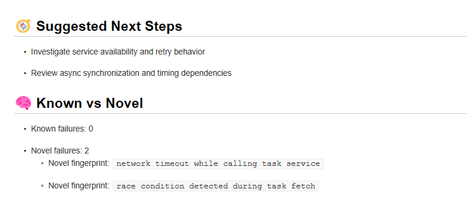
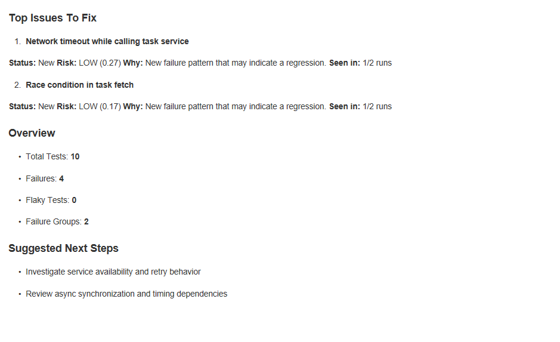
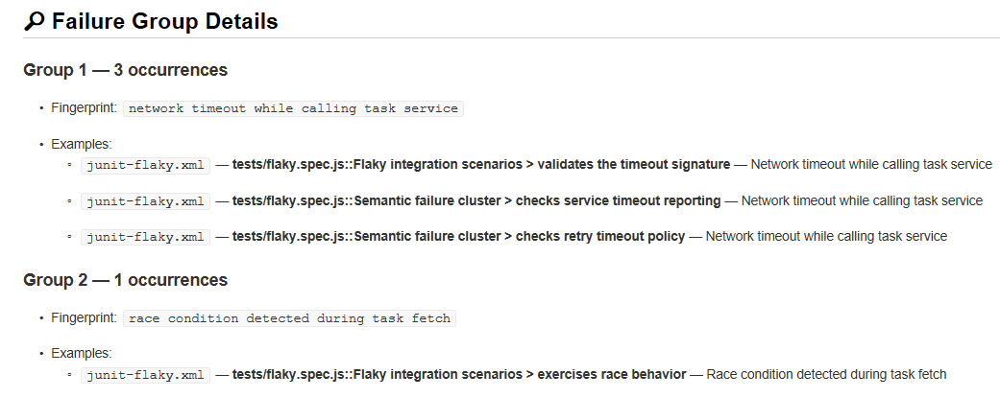

# FlakeShield

FlakeShield reads repeated JUnit XML runs and turns them into a short CI triage report — flaky tests, grouped failures, and what to fix first. One workflow step. No pip install. No secrets.

## Install

```yaml
- name: Run FlakeShield
  uses: deeoli/flakeshield-action@v0.6.0-beta.1
  with:
    reports: "outputs/junit_run*.xml"
    out_prefix: outputs/flake_report
    db_path: outputs/flakeshield.db
```

Run tests at least twice to produce JUnit XML (FlakeShield needs multiple runs), then point `reports` at those files. Full example: [`examples/canonical-workflow.yml`](examples/canonical-workflow.yml).

## What You Get

FlakeShield generates:

- `flake_report.md`
- `flake_report.json`
- `flake_report_pr_comment.md`

### Fix First


Risk-ranked issues engineers should investigate first.

### Suggested Next Steps



Actionable investigation guidance generated from recurring failure patterns.

### PR Summary



Compact pull-request summaries focused on what matters.

### Failure Grouping



Multiple failures compressed into root-cause groups.

## Example Repository

Working setup: **[deeoli/flakeshield-demo](https://github.com/deeoli/flakeshield-demo)**

## Why It Exists

CI output gets noisy fast. FlakeShield reduces that noise into a ranked summary so teams see clearer engineering signal. Spend less time parsing logs — more time fixing what actually matters.
